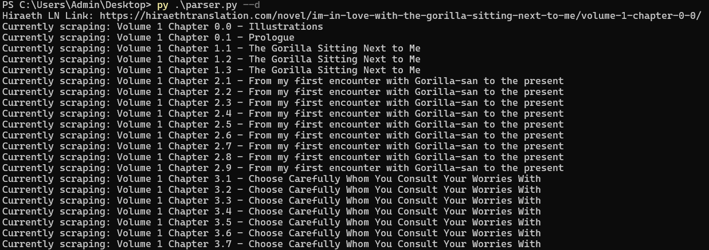
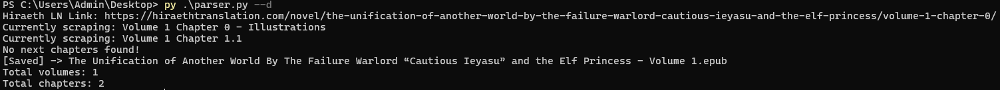

# novel2epub
The light novel that I wanted to read was only accessible online, I couldn't read it offline unless I download every single page or screenshot. So I came up with the this Python program that solves that problem. The program gets all the necessary information from the site, then generates a file for me.

## Features
- Validates the provided link before scraping
- Scrapes the book title, chapter titles, and chapter contents
- Splits chapters by volume automatically
- Generates a separate EPUB file per volume

## Important Notes
- This is specifically made for the site `https://hiraethtranslation.com`, other sites may not work.
- Only works with `Light Novel` genre.
- Doesn't include the **images**.
- Only tested on Windows

## How to Use
1. Make sure you have Python installed (download from the official site if needed)
2. Install the requirements.txt
	```bash
	pip install -r requirements.txt
	```
3. Provide the link to the **first chapter** of the novel when prompted.
4. Run the program with either of these:
	1. Prints out the progress.
		```python
		python novel2epub.py --d
		```
	2. Or without the print statements.
		```python
		python novel2epub.py
		```
## Pictures




